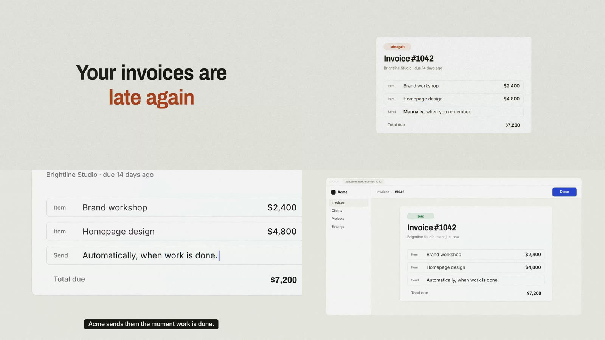

# no-slop-motion

An agent skill for making launch and brand films that look directed, not AI-generated.

Agents can now write, voice, animate and render a whole video. Left to their defaults, they make the same film every time: a montage cut to a loud track, card grids, glowing gradients, text popping in, a feature tour with no story. This skill replaces those defaults with a process that grounds every decision in something real: your customers' pain, your brand's own assets, your narrator's delivery, the structure of your music.



## What is inside

- **[SKILL.md](skills/no-slop-motion/SKILL.md)**: the process as ten gates (inputs, pain, script, voice, world, hero, animatic, build, sound, QA), the standing rules, and the default banned list.
- **[references/](skills/no-slop-motion/references/)**: one guide per gate.
- **[templates/](skills/no-slop-motion/templates/)**: brief, pain bank, script, design spec, shot list, cue sheet, and the loves and hates file.
- **[starter/](skills/no-slop-motion/starter/)**: a [HyperFrames](https://hyperframes.heygen.com) project with a small film engine: one seekable timeline, a timing table the whole film reads from, actors that can move "on twos" like stop motion, cameras, word-timed captions and sound cues.
- **[scripts/](skills/no-slop-motion/scripts/)**: voiceover takes (Cartesia), take scoring, splitting voice only in real silences, joining music on downbeats, cue sheet checks, a banned-pattern linter, a pop and flash detector, contact sheets, rendering with a mix, and social exports.

It works for brands with or without a mascot. Without one, the film follows a hero object the brand already owns: the logo mark, a signature button, the cursor, a sound.

## Install

With the [skills CLI](https://github.com/vercel-labs/skills):

```bash
npx skills add ferndesk/no-slop-motion
```

Or copy it by hand (Claude Code shown; other agents have their own skills folder):

```bash
git clone https://github.com/ferndesk/no-slop-motion
cp -r no-slop-motion/skills/no-slop-motion ~/.claude/skills/
```

It builds on HyperFrames, so install its skills too:

```bash
npx hyperframes skills
```

## Requirements

- Node 22+, ffmpeg, Google Chrome or the HyperFrames headless shell (`npx hyperframes browser ensure`)
- Python 3.10+ with the packages in each `scripts/*/requirements.txt`
- A TTS key (`CARTESIA_API_KEY`) for the voice, and a music tool such as Suno or a licensed track

## Use

Ask your agent for a launch film:

> Make a launch video for our product for X. Our site is acme.com, call transcripts are in ./calls, and I like the look of <reference>.

The skill starts at Gate 0 and asks for the inputs it cannot find. Expect to sign off a one-page brief, a script, a voice, five still frames and an animatic before the full build. Those locks are what make it fast: story and style take the most rounds, and far more when they are attempted at the same time as everything else.

## License

MIT. The bundled fonts are under the SIL Open Font License (see their folders).
